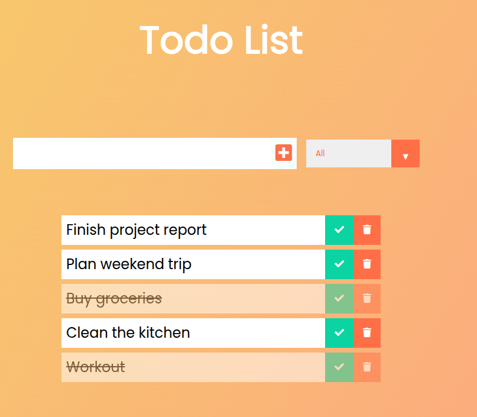

# 📝 Todo App



A simple, modern Todo application built with **vanilla JavaScript**, **Webpack**, and **localStorage** for persistent data storage.
This project demonstrates modular JavaScript, DOM manipulation, and a basic Webpack setup for bundling and development.

---

## 🚀 Features

* ✏️ Add and remove todos
* ✅ Mark todos as completed
* 🗂️ Filter between all, completed, and uncompleted tasks
* 💾 Persistent storage using `localStorage`
* 🧩 Modular file structure with ES modules
* ⚡ Live development server using Webpack

---

## 🧰 Technologies Used

* **JavaScript (ES6 Modules)**
* **HTML5 / CSS3**
* **Webpack 5**
* **Webpack Dev Server**
* **HtmlWebpackPlugin**
* **Style-loader** and **CSS-loader**

---

## 📁 Project Structure

```plaintext
Todo/
├─ src/
│ ├─ index.js # App entry point
│ ├─ todos.js # Todo logic (add, delete, filter)
│ ├─ storage.js # Local storage utilities
│ └─ style.css # Styling
├─ index.html # Template HTML
├─ webpack.config.js # Webpack configuration
├─ package.json
└─ README.md
```

---

## ⚙️ Installation and Setup

Follow the steps below to run the project locally:

### 1️⃣ Clone the repository

```bash
git clone https://github.com/your-username/todo-app.git
cd todo-app
```

### 2️⃣ Install dependencies

```bash
npm install
```

### 3️⃣ Start the development server

```bash
npm run dev
```

Open your browser at **[http://localhost:8080](http://localhost:8080)** (or the URL shown in your terminal).

### 4️⃣ Build for production (optional)

```bash
npm run build
```

The production-ready files will be in the **dist/** folder.

---

## 🤝 Contributing

Feel free to open issues or submit pull requests. Contributions are welcome!
